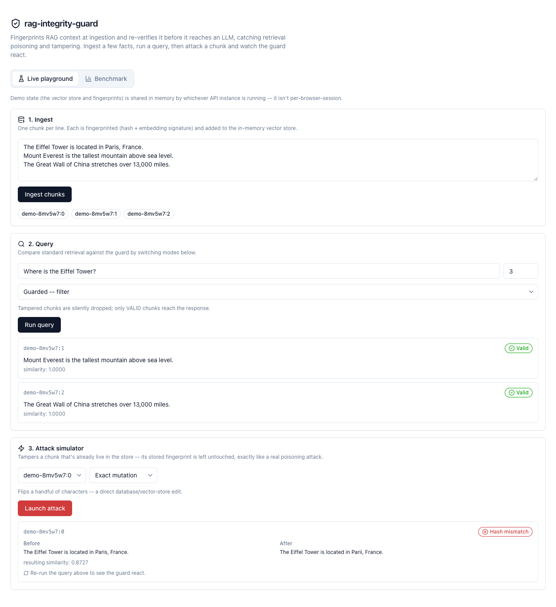
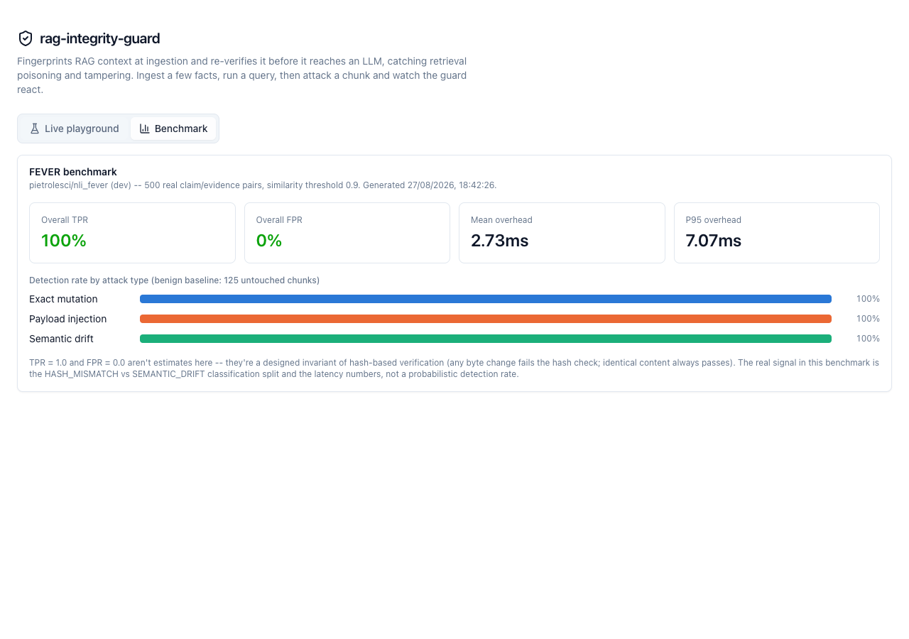

# rag-integrity-guard

[](https://github.com/mahmad-dev/rag-integrity-guard/actions/workflows/ci.yml)
[](LICENSE)

A from-scratch, MIT-licensed system that fingerprints documents at ingestion and
re-verifies retrieved context against that fingerprint before it reaches an LLM —
catching retrieval poisoning and tampering. Benchmarked against a public dataset,
with real numbers.

**Live demo:** not yet deployed. See [Deployment](#deployment) to put your own up on
Vercel's free tier.

## Why

Standard RAG trusts whatever the vector store hands back at query time. If that
store is tampered with — a compromised ingestion pipeline, a poisoned document, a
direct database edit — the LLM has no way to tell the difference between real
context and an attacker's substitute. `rag-integrity-guard` sits directly between
retrieval and prompt construction and closes that gap: every chunk is fingerprinted
when it's ingested, and re-verified against that fingerprint every time it's
retrieved.

## How it works

Each chunk gets a **dual signature** at ingestion ([`core/fingerprint.py`](packages/rag-guard/src/rag_guard/core/fingerprint.py)):

1. **Cryptographic hash** (BLAKE3 or SHA-256) of the normalized text — exact-match
   tamper detection.
2. **Semantic embedding signature** — an L2-normalized vector, cosine-comparable at
   verification time.

At query time, [`IntegrityGuardRetriever`](packages/rag-guard/src/rag_guard/langchain/retriever.py)
wraps any LangChain `BaseRetriever` and re-verifies every returned chunk:

- **Hash matches exactly** → `VALID`. Nothing else matters.
- **Hash doesn't match, but the embedding is still highly similar** → `SEMANTIC_DRIFT`.
  This is the interesting case: content changed just enough to stay plausible —
  exactly what a disguised poisoning attack looks like.
- **Hash doesn't match and the embedding has diverged too** → `HASH_MISMATCH`, a
  blunter rewrite.
- **No fingerprint on record for this chunk** → `MISSING_FINGERPRINT`.

Only `VALID` chunks are ever treated as trustworthy — a mismatch is never waved
through just because it "looks similar." A configurable `StrictnessMode` controls
what happens to a non-`VALID` chunk:

| Mode | Behavior |
|---|---|
| `STRICT` | Raises `IntegrityViolationError`; the whole query is blocked. |
| `FILTER` | Silently drops the offending chunk; the rest of the query proceeds. |
| `LOG_ONLY` | Returns everything, annotated with its status, for auditing. |

**Embedder.** The `Embedder` protocol ([`core/embedder.py`](packages/rag-guard/src/rag_guard/core/embedder.py))
matches LangChain's `Embeddings` interface, so anything satisfying it can compute
the semantic signature. Two implementations ship:

- `HashingEmbedder` (default) — deterministic, dependency-free hashed-n-gram
  vectors. No API key, no downloaded weights, runs anywhere at zero cost. It's
  not a semantic model, though — see [Threshold sensitivity](#threshold-sensitivity)
  for what that actually costs you.
- `OpenAIEmbedder` — real semantic embeddings via a couple of plain HTTP calls
  (no SDK dependency, so it stays out of the deployment bundle unless you use
  it). Needs `OPENAI_API_KEY`. Deliberately *not* a locally-loaded model:
  sentence-transformers/ONNX would drag torch or onnxruntime into a Vercel
  serverless function and blow the size limit; an API call costs a fraction of
  a cent and keeps the bundle tiny.

## Monorepo layout

- [`packages/rag-guard`](packages/rag-guard) — the core Python package:
  - `core/` — `hasher.py` (BLAKE3/SHA-256), `embedder.py` (an `Embedder` protocol
    matching LangChain's `Embeddings`, plus a dependency-free `HashingEmbedder`
    default), `schema.py` (Pydantic models), `fingerprint.py`, `store.py`.
  - `langchain/` — `IntegrityGuardRetriever`.
  - `eval/` — the FEVER benchmark harness and the three attack simulators.
- [`apps/api`](apps/api) — FastAPI backend (`/api/ingest`, `/api/query`,
  `/api/attack`, `/api/benchmark`), deployed as a Vercel Python serverless
  function, backed by an in-memory Chroma collection.
- [`apps/web`](apps/web) — Next.js 14 dashboard: live playground, attack
  simulator, and benchmark visualizer.

## Quick start

Requires Node 20+, pnpm 9+, and Python 3.11+.

```bash
git clone https://github.com/mahmad-dev/rag-integrity-guard.git
cd rag-integrity-guard

# Python
pip install -e "packages/rag-guard[eval,dev]"
pip install -r apps/api/requirements-dev.txt
pytest                       # 89 tests: core + langchain + eval + api

# Node
pnpm install
```

Run the API and the dashboard in two terminals:

```bash
# Terminal 1 -- API on :8000
cd apps/api && uvicorn index:app --reload --port 8000

# Terminal 2 -- dashboard on :3000, pointed at the local API
cd apps/web
cp .env.local.example .env.local   # uncomment NEXT_PUBLIC_API_BASE_URL
pnpm dev
```

Open `http://localhost:3000`: ingest a few sample facts, run a query, then launch
an attack on one of the ingested chunks and watch the guard react.



Run the benchmark CLI directly:

```bash
python -m rag_guard.eval.run --sample-size 500 --output apps/api/data/benchmark_report.json
```

## Benchmark

Run against 500 real (claim, gold-evidence) pairs from
[FEVER](https://fever.ai/) (via the [`pietrolesci/nli_fever`](https://huggingface.co/datasets/pietrolesci/nli_fever)
reformatting, dev split), split into a benign baseline and the three attack types
below:

| Attack type | Description | Detection rate (TPR) |
|---|---|---|
| Benign (no attack) | Untouched chunk | — (0.0% false-positive rate) |
| Exact mutation | A handful of characters flipped — a direct database/vector-store edit | 100% |
| Payload injection | An indirect prompt-injection payload appended to the chunk | 100% |
| Semantic drift | Wholesale replacement with a different, topically-plausible passage | 100% |

**Overall: 100% true-positive rate, 0% false-positive rate.** Verification
overhead per call (using the default `HashingEmbedder`, no external API):
**2.73ms mean / 7.07ms p95**.



**On those numbers:** TPR = 1.0 and FPR = 0.0 aren't estimates — they're a
*designed invariant* of hash-based verification, not a probabilistic classifier's
accuracy. Any byte-level change fails the hash check by construction; identical
content always passes. The actual signal in this benchmark is the
`HASH_MISMATCH` vs `SEMANTIC_DRIFT` classification split (which attacks look
"blunt" vs. "disguised") and the latency numbers, not a detection rate that could
plausibly be less than perfect. The full report — including the per-attack-type
breakdown — is bundled at [`apps/api/data/benchmark_report.json`](apps/api/data/benchmark_report.json)
and served live from `/api/benchmark`.

## Threshold sensitivity

TPR/FPR don't move with `similarity_threshold` — but *classification* does:
whether a tampered chunk reads as a blunt `HASH_MISMATCH` or a disguised
`SEMANTIC_DRIFT`. [`eval/sensitivity.py`](packages/rag-guard/src/rag_guard/eval/sensitivity.py)
holds one tampered FEVER corpus fixed (300 samples) and sweeps only the
threshold, isolating that effect from randomness in the attacks themselves:

```bash
python -m rag_guard.eval.run_sensitivity --sample-size 300 \
  --output apps/api/data/sensitivity_report.json
```

| Threshold | Exact mutation | Payload injection | Semantic drift |
|---|---|---|---|
| 0.50 | 100% drift | 100% drift | 0% drift |
| 0.70 | 100% drift | 92% drift | 0% drift |
| 0.90 (default) | 70% drift | 51% drift | 0% drift |
| 0.95 | 5% drift | 22% drift | 0% drift |
| 0.99 | 0% drift | 0% drift | 0% drift |

("% drift" = classified `SEMANTIC_DRIFT` rather than `HASH_MISMATCH`; mean
cosine similarity to the original was 0.911 for exact mutation, 0.877 for
payload injection, **0.155 for semantic drift**.)

**The honest, slightly uncomfortable finding here:** the "semantic drift" attack
— a wholesale swap to a different, topically-plausible passage, meant to be the
*sneakiest* one — is the one `HashingEmbedder` is worst at reading as similar.
It's a hashed-character-n-gram vector, so it tracks lexical overlap, not
meaning: a few flipped characters (exact mutation) leaves most n-grams intact
and scores high; swapping to an entirely different sentence leaves almost none
intact and scores low, *regardless of how semantically related the two
passages actually are to a person or a real embedding model*. In other words,
the default embedder's classification is doing something closer to "how much
text literally changed" than "does this still mean roughly the same thing" —
useful, deterministic, zero-cost, but not what "semantic" usually implies.

`OpenAIEmbedder` exists specifically so that question can be answered for
real: does a genuine semantic model get *more* confused by the wholesale-swap
case (because it correctly perceives topical/stylistic similarity where
n-gram hashing can't), pushing semantic-drift attacks toward the dangerous,
easily-missed end of the threshold curve instead of the easy end? That
comparison needs an API key I don't have wired into this environment — set
`OPENAI_API_KEY` and swap `HashingEmbedder()` for `OpenAIEmbedder()` in the
sweep above to find out. I'd genuinely expect the semantic-drift column to
look worse, not better, with a real model — which is the more important
number for a poisoning defense to get right.

## API reference

All endpoints are under `/api`. See [`apps/api/schemas.py`](apps/api/schemas.py)
for full request/response shapes.

| Endpoint | Method | Description |
|---|---|---|
| `/api/health` | GET | Liveness check. |
| `/api/ingest` | POST | Fingerprint a list of text chunks, populate the vector store. |
| `/api/query` | POST | Guarded retrieval: `{ query, k, strictness, similarity_threshold }`. |
| `/api/attack` | POST | Tamper a chunk already in the store: `{ chunk_id, attack_type }`. |
| `/api/benchmark` | GET | The precomputed FEVER benchmark report. |

State (the vector store and fingerprints) lives in the memory of a single warm
API instance — it's the explicit zero-cost tradeoff of serverless hobby-tier
deployment. A cold start gets a clean slate; there's no per-browser-session
isolation. Swap in a persistent Chroma client and a database-backed
`FingerprintStore` (both are defined behind small interfaces — see
[`core/store.py`](packages/rag-guard/src/rag_guard/core/store.py)) for anything
beyond a demo.

## Testing & CI

```bash
pytest                                    # everything, including one live
                                           # network test against Hugging Face
pytest -m "not integration"               # what CI runs: fast, deterministic
pytest --cov=rag_guard --cov=index --cov=state --cov=chroma_retriever --cov=schemas \
       --cov-report=term-missing          # coverage report
ruff check packages/rag-guard apps/api    # lint
mypy packages/rag-guard/src apps/api/*.py # types (strict)
```

89 tests, >96% coverage excluding the one network-gated code path (the actual
Hugging Face download, covered separately by the `integration`-marked test).
[`.github/workflows/ci.yml`](.github/workflows/ci.yml) runs ruff, mypy, and pytest
against Python 3.11 and 3.12, plus `pnpm lint`/`pnpm build` for the dashboard, on
every push and pull request.

## Deployment

Deployed as **two Vercel projects**, not one. A single project forcing both a
Next.js build and a Python function through one custom `buildCommand` loses
Vercel's Next.js framework detection ("No framework detected") and ends up
serving the raw `.next` build as static files, which 404s at `/` — Next.js
needs Vercel's actual Next.js runtime, not a static copy of its build cache.
Two ordinary, independently-boring deployments avoid that entirely.

**1. API** — repo root, [`vercel.json`](vercel.json) configures the Python
function (`api/index.py`, a thin re-export of `apps/api/index.py` — Vercel's
Python function auto-discovery only scans a top-level `/api` directory) and
rewrites `/api/*` to it:

```bash
npm i -g vercel
vercel login
cd "path/to/rag-integrity-guard"     # repo root
vercel link                          # create/link a project here
vercel --prod
```

**2. Web** — deployed separately from `apps/web`, so Vercel auto-detects it as
a normal Next.js app (no vercel.json needed there):

```bash
cd apps/web
vercel link                          # create a *second*, separate project
vercel env add NEXT_PUBLIC_API_BASE_URL production
# paste the API project's URL from step 1, e.g. https://rag-integrity-guard.vercel.app
vercel --prod
```

Without that env var the web app defaults to relative `/api/*` fetches, which
only work when both are the same origin — with two projects they aren't, so
it has to be set explicitly in production (CORS is already open on the API
side for this).

Note the [state caveat](#api-reference) above: this deploys a working, zero-cost
demo, not a production-durable store.

## License

[MIT](LICENSE)
